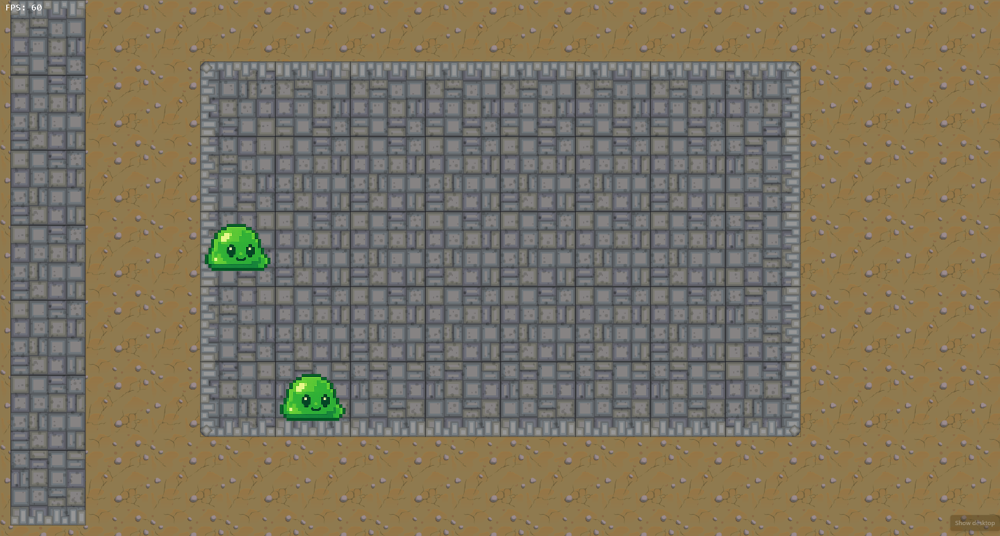
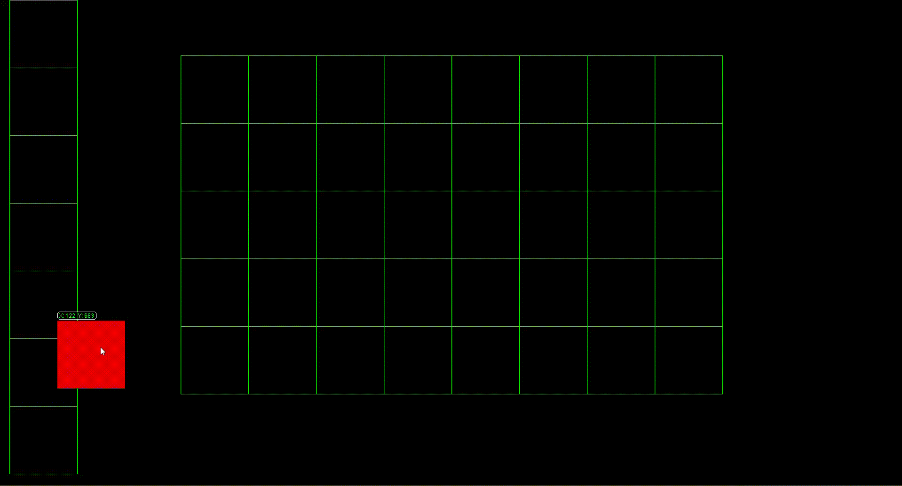

# Auto Battler

Auto Battler is a subgenre of strategy video games that typically features chess-like elements. Players place characters on a grid-shaped battlefield during a **preparation phase**, and those characters automatically battle opponents without any further player input.

## Features Completed

- Grid-based battlefield
- Vertical deck area for available units
- Drag-and-drop interaction
- Snapping logic (to deck and battlefield)
- Valid cell restrictions (no snapping outside)
- Monsters with assets
## Preview

26-07-2025

26-07-2025

25-07-2025

---
